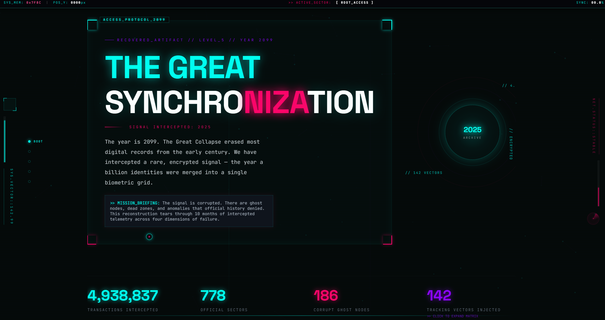

# THE GREAT SYNCHRONIZATION // ARCHIVE_2025

> [!IMPORTANT]
> **RECOVERED_ARTIFACT // LEVEL_5 // RECONSTRUCTION_PROTOCOL_v5**
>
> _“The year is 2099. The Great Collapse erased most digital records. We are Data Archaeologists, scavenging the ruins of the old internet for fragments of the past. This is our most significant find: a rare, encrypted signal from the year 2025—the year a billion identities were merged into a single grid.”_

---

## 📂 CASE_FILE: MISSION_BRIEFING

This project is a narrative-driven forensic data exploration of the **2025 Great Synchronization**. By analyzing over **4.9 million intercepted transactions**, we reconstruct the pulse of an era marked by massive biometric integration, systemic anomalies, and geographic dark zones.

> [!WARNING]
> The signal is corrupted. There are **ghost nodes**, **dead zones**, and **anomalies** that official history denied.

The investigation is divided into **four dimensions of failure**:

1.  **PROTOCOL: PURGE_CORRUPTION** – Identifying sectors where the grid went dark.
2.  **SYSTEM: NEURAL_ENRICHMENT** – Mapping the enrollment EKG and seasonal spikes.
3.  **SCAN: THE_DARK_ZONES** – Separating signal from noise in a corrupted 778-node grid.
4.  **DECODE: THE_COMPLETE_SIGNAL** – Tracking the movement of a population through demographic drift.

---

## 🛠️ INTERCEPT_TOOLS: Data Engineering Stack

To hear what the raw data won't say, we utilized a specialized recovery stack for deep-packet inspection and signal reconstruction:

```yaml
system_logic: Python_3.x
data_reconstruction:
  - Pandas
  - NumPy
holographic_mapping: Plotly_v5
anomaly_detection: SciPy_Stats
signal_purification: FuzzyWuzzy
telemetry_tracking: tqdm
```

---

## 🔬 METHODOLOGY: Reconstruction Protocol

The reconstruction follows a strict multi-layer forensic methodology derived from the **2099 Archaeologist Handbook**:

| PROTOCOL        | LAYER | DESCRIPTION                                               |
| :-------------- | :---- | :-------------------------------------------------------- |
| **UNIVARIATE**  | 01    | Stripping signals to their core distributions.            |
| **BIVARIATE**   | 02    | Crossing wires between temporal events and volume spikes. |
| **TRIVARIATE**  | 03    | Correlation of Geography x Equity x Volume.               |
| **SPATIAL**     | 04    | Coordinate-mapped density projection onto the grid.       |
| **TIME SERIES** | 05    | Momentum vectors and velocity tracking.                   |

---

## 📡 SOURCE_INTEL

The data signal originates from the historical **UIDAI (Unique Identification Authority of India)** archives, covering the critical window of **March – December 2025**.

> [!NOTE]
> Reconstruction managed by **Archivist: Kshitij Dubey**

---

**[TRANSMISSION SEALED]**

```
>> LOG_CLOSE: SUCCESS
>> BYTES_RECOVERED: 4,938,837
>> NO_GHOSTS_LEFT: FALSE
```
